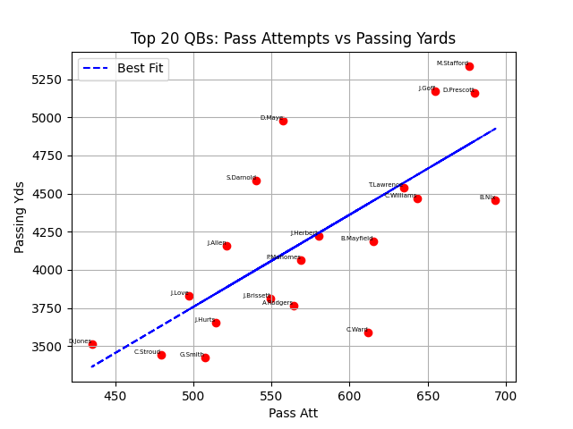

# NFL API Data Analysis
This program uses a sports API to retrieve live player data, and organize it using pandas and matplotlib

## Overview
This program can display single player stats, compare 2 or more player stats, sort players by position and statistic, and display plots with player data. 

## Example Output
Player Comparison
(Jahmyr Gibbs, Bijan Robinson, and Derrick Henry)
```
            RushingYards  ReceivingYards  PassingYards
Name                                                  
J.Gibbs           1385.7           697.9           0.0
B.Robinson        1674.6           929.1           0.0
D.Henry           1807.1           170.0           0.0
```

Sorting by position
(QB, PassingYards)

```
           Position  PassingYards
Name                             
M.Stafford       QB        5333.0
J.Goff           QB        5171.0
D.Prescott       QB        5157.4
D.Maye           QB        4978.4
S.Darnold        QB        4586.4
T.Lawrence       QB        4539.9
C.Williams       QB        4466.3
```

## Example Plots

### Running Backs Plot


### QBs Plot


### Player Comparison Plot


## Skills Demonstrated
- Python programming
- Using APIs to retrieve data
- Reading and parsing JSON data
- Data organization with pandas DataFrames
- Basic data visualization with matplotlib
- Filtering, sorting, and comparing datasets
- Creating professional plots for analysis
